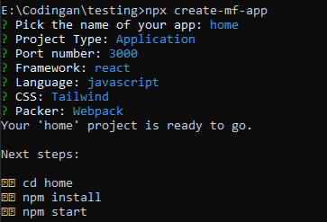
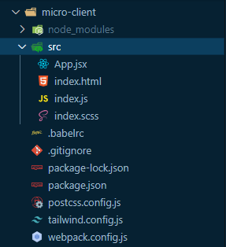

## Prasyarat

- Node.js

## Instalasi

Ini adalah perintah untuk membuat proyek micro-frontend.

  ```bash
    npx create-mf-app
  ```
Perintah ini akan meminta pengguna mengisi beberapa informasi seperti nama aplikasi, port, framework (misalnya React), bahasa pemrograman, dan CSS.

Berikut ini tampilan dari CLI tersebut : 

 

Kemudian ini merupakan beberapa file dan folder bawaan dari CLI micro-frontend : 

 

Berikut adalah penjelasan mengenai setiap file dan folder dalam struktur yang Anda berikan:

 - node_modules: Ini adalah folder yang biasanya dihasilkan oleh manajer paket (seperti npm atau yarn) setelah  menginstal semua dependensi proyek.
 - src: Folder ini berisi kode sumber utama dari aplikasi.
 - App.jsx: Ini mungkin merupakan komponen utama aplikasi.
 - index.html: File ini adalah halaman HTML utama yang akan dimuat oleh browser ketika aplikasi dijalankan.
 - index.js: File ini adalah titik masuk (entry point) untuk aplikasi. Di sini, akan menginisialisasi aplikasi dan me-render komponen utama ke dalam elemen HTML.
 - index.scss: Ini adalah file gaya (styling) menggunakan bahasa Sass (atau SCSS).
 - .babelrc: File konfigurasi untuk Babel, alat yang digunakan untuk mengonversi kode JavaScript modern ke format yang dapat dijalankan oleh browser yang lebih tua.
 - .gitignore: File ini berisi daftar file dan folder yang harus diabaikan oleh Git saat melakukan commit ke repositori.
 - package-lock.json: File ini berisi informasi tentang versi spesifik dari semua dependensi yang digunakan dalam proyek.
 - package.json: File konfigurasi untuk proyek. Di sini, akan menentukan informasi seperti nama proyek, versi, dependensi, skrip npm, dan lainnya.
 - postcss.config.js: File konfigurasi untuk PostCSS, alat yang digunakan untuk mengelola transformasi CSS. Ini memungkinkan Anda menggunakan fitur-fitur seperti autoprefixer dan minifikasi CSS.
 - tailwind.config.js: File konfigurasi untuk Tailwind CSS.
 - webpack.config.js: File konfigurasi untuk Webpack, alat yang digunakan untuk menggabungkan dan mengemas semua file sumber menjadi satu atau beberapa file output (misalnya bundle.js). Ini juga mengatur bagaimana aset seperti gambar dan font dikelola dan dimuat oleh aplikasi.


## Demo (Micro-frontend sederhana)

