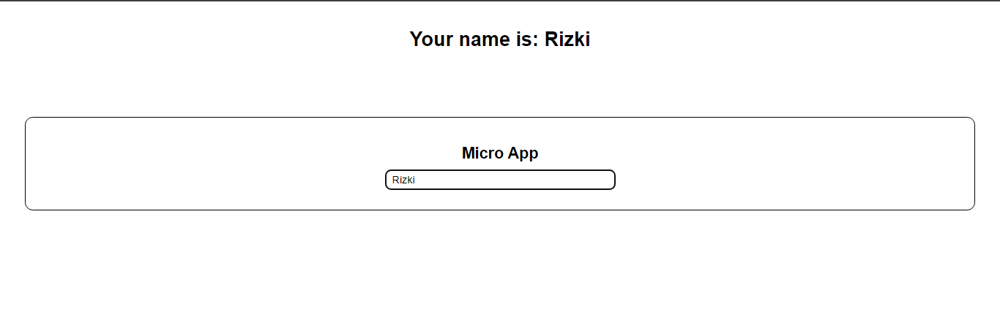
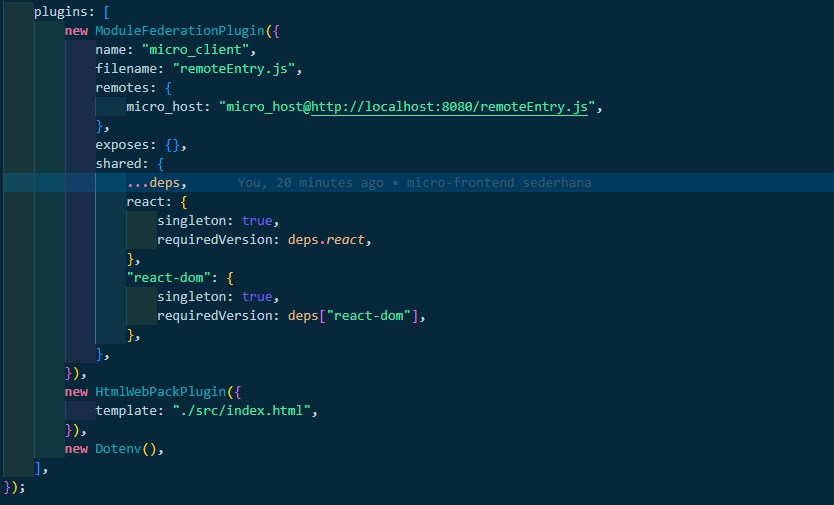

## Belajar Micro-frontend, webpack, dan module federation

Pada Program ini merupakan program pembelaharan dari micro-frontend, webpack, dan module federation

## Prasyarat

- Node.js

## Instalasi

Ini adalah perintah untuk membuat proyek micro-frontend.

  ```bash
    npx create-mf-app
  ```
Perintah ini akan meminta pengguna mengisi beberapa informasi seperti nama aplikasi, port, framework (misalnya React), bahasa pemrograman, dan CSS.

Berikut ini tampilan dari CLI tersebut : 

 


Setelah itu, lakukan instalasi dependensi dengan perintah berikut : 

  ```bash
    npm install
  ```
  atau
  ```bash
    yarn install
  ```
Setelah itu, proyek micro-frontend siap untuk digunakan dan untuk menjalankannya dengan perintah berikut: 

  ```bash
    npm run start
  ```
  atau
  ```bash
    yarn start
  ```


Kemudian ini merupakan beberapa file dan folder bawaan dari CLI micro-frontend : 

 

## Struktur Proyek

Berikut adalah penjelasan mengenai setiap file dan folder dalam struktur yang Anda berikan:

 - node_modules: Ini adalah folder yang biasanya dihasilkan oleh manajer paket (seperti npm atau yarn) setelah  menginstal semua dependensi proyek.
 - src: Folder ini berisi kode sumber utama dari aplikasi.
 - App.jsx: Ini mungkin merupakan komponen utama aplikasi.
 - index.html: File ini adalah halaman HTML utama yang akan dimuat oleh browser ketika aplikasi dijalankan.
 - index.js: File ini adalah titik masuk (entry point) untuk aplikasi. Di sini, akan menginisialisasi aplikasi dan me-render komponen utama ke dalam elemen HTML.
 - index.scss: Ini adalah file gaya (styling) menggunakan bahasa Sass (atau SCSS).
 - .babelrc: File konfigurasi untuk Babel, alat yang digunakan untuk mengonversi kode JavaScript modern ke format yang dapat dijalankan oleh browser yang lebih tua.
 - .gitignore: File ini berisi daftar file dan folder yang harus diabaikan oleh Git saat melakukan commit ke repositori.
 - package-lock.json: File ini berisi informasi tentang versi spesifik dari semua dependensi yang digunakan dalam proyek.
 - package.json: File konfigurasi untuk proyek. Di sini, akan menentukan informasi seperti nama proyek, versi, dependensi, skrip npm, dan lainnya.
 - postcss.config.js: File konfigurasi untuk PostCSS, alat yang digunakan untuk mengelola transformasi CSS. Ini memungkinkan Anda menggunakan fitur-fitur seperti autoprefixer dan minifikasi CSS.
 - tailwind.config.js: File konfigurasi untuk Tailwind CSS.
 - webpack.config.js: File konfigurasi untuk Webpack, alat yang digunakan untuk menggabungkan dan mengemas semua file sumber menjadi satu atau beberapa file output (misalnya bundle.js). Ini juga mengatur bagaimana aset seperti gambar dan font dikelola dan dimuat oleh aplikasi.

## Penjelasan Webpack 

```bash
const HtmlWebPackPlugin = require("html-webpack-plugin");
const ModuleFederationPlugin = require("webpack/lib/container/ModuleFederationPlugin");
const Dotenv = require("dotenv-webpack");
const deps = require("./package.json").dependencies;
module.exports = (_, argv) => ({
	output: {
		publicPath: "http://localhost:8080/",
	},

	resolve: {
		extensions: [".tsx", ".ts", ".jsx", ".js", ".json"],
	},

	devServer: {
		port: 8080,
		historyApiFallback: true,
	},

	module: {
		rules: [
			{
				test: /\.m?js/,
				type: "javascript/auto",
				resolve: {
					fullySpecified: false,
				},
			},
			{
				test: /\.(css|s[ac]ss)$/i,
				use: ["style-loader", "css-loader", "postcss-loader"],
			},
			{
				test: /\.(ts|tsx|js|jsx)$/,
				exclude: /node_modules/,
				use: {
					loader: "babel-loader",
				},
			},
		],
	},

	plugins: [
		new ModuleFederationPlugin({
			name: "micro_host",
			filename: "remoteEntry.js",
			remotes: {},
			exposes: {
				"./Content": "./src/components/Content",
			},
			shared: {
				...deps,
				react: {
					singleton: true,
					requiredVersion: deps.react,
				},
				"react-dom": {
					singleton: true,
					requiredVersion: deps["react-dom"],
				},
			},
		}),
		new HtmlWebPackPlugin({
			template: "./src/index.html",
		}),
		new Dotenv(),
	],
});

```

Berikut penjelasan singkat tentang setiap bagian dari konfigurasi webpack:

1. HtmlWebPackPlugin: Plugin ini digunakan untuk menghasilkan file HTML yang digunakan sebagai template dalam proyek webpack. Dalam konfigurasi ini, plugin digunakan untuk menghasilkan file HTML dari template yang ada di ./src/index.html.

2. ModuleFederationPlugin: Ini adalah plugin dari webpack yang memungkinkan aplikasi untuk menggunakan modul-modul dari aplikasi lain, baik yang berjalan pada domain yang sama maupun domain yang berbeda. Dalam konfigurasi ini:

- name: Menentukan nama host modul.
- filename: Nama file untuk remote entry point.
- remotes: Daftar modul yang akan dimuat secara remote.
- exposes: Menentukan modul mana yang akan di-expose oleh host.
- shared: Menentukan modul mana yang akan dibagikan bersama antara host dan remote.
- Dotenv: Plugin ini memungkinkan penggunaan variabel lingkungan yang didefinisikan dalam file .env dalam konfigurasi webpack. Dalam konfigurasi ini, plugin digunakan untuk mengimpor variabel lingkungan dari file .env ke dalam konfigurasi webpack.

3. Dependencies (deps): Objek ini berisi daftar dependensi dari proyek yang didefinisikan dalam file package.json. Deps digunakan dalam konfigurasi ModuleFederationPlugin untuk menentukan versi yang dibutuhkan dari dependensi bersama seperti React dan ReactDOM, serta menandai modul-modul tersebut sebagai singleton untuk memastikan bahwa hanya ada satu salinan dari setiap modul di seluruh aplikasi.


## Demo (Micro-frontend sederhana)

Ini adalah program web sederharna input nama, membuat sebuah input yang nantinya akan langsung ditampilkan setiap pengguna melakukan input.

Pertama, berikut ini terdapat dua folder micro-frontend yaitu client dan host : 

- Host  


- Client


Kedua, ini adalah tampilan dari app-host : 





Pada tampilan app-host ini, pembuat ingin melakukan import atau expose program component dari app-host ini kepada app-client, maka diperlukan sebuah configurasi dibagian webpack program host untuk dapat dilakukan import. sebagai berikut : 


Ketiga, untuk dapat menerima hasil import dari program host maka client melakukan configurasi pada webpack dengan melakukan remotes terdapat host : 





Keempat, untuk dapat menampilkan ke program app-client, maka client harus melakukam import sebagai berikut : 


Kelima, untuk dapat melihat hasilnya dapat dilakukan CLI : ```npm run start```


